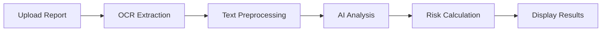

# 🏥 AI Medical Report Analyzer

>MediAnalyze is a modern, AI-powered web application that analyzes blood test reports and provides intelligent health insights. Built with React, TypeScript, and Tailwind CSS, it leverages the Groq API for fast, accurate medical analysis and Tesseract.js for optical character recognition (OCR).

## 📋 Overview

AI Medical Report Analyzer helps users understand their medical test results by:
- 🔍 **Extracting data** from medical reports using OCR technology
- 🤖 **Analyzing metrics** with Mixtral AI (8x7B model)
- ⚠️ **Predicting health risks** based on established medical ranges
- 💡 **Generating recommendations** for preventive healthcare

---

## ✨ Features

📤 File Upload

•
Drag-and-drop interface for easy file upload

•
Multiple format support: PDF, JPG, PNG

•
File validation with size limits (max 10MB)

•
Real-time feedback with loading states

🔍 OCR Text Extraction

•
Tesseract.js for image text extraction

•
PDF.js for PDF document processing

•
Automatic language detection (English optimized)

•
Error handling for corrupted or unclear images

🤖 AI-Powered Analysis

•
Groq API integration (Mixtral 8x7B model)

•
Automatic blood metric detection (glucose, cholesterol, etc.)

•
Intelligent pattern recognition from medical reports

•
Structured JSON responses for reliable parsing

📊 Blood Metrics Extraction

Automatically detects and displays:

•
Glucose (Fasting/Random)

•
Cholesterol (Total, LDL, HDL)

•
Triglycerides

•
HbA1c (Glycated Hemoglobin)

•
Blood Pressure (Systolic/Diastolic)

•
Complete Blood Count (WBC, RBC, Hemoglobin, Hematocrit, Platelets)

•
Liver Function Tests (ALT, AST, Bilirubin)

•
Kidney Function Tests (Creatinine, BUN)

•
Thyroid Function (TSH, T3, T4)

•
And more...

⚠️ Health Risk Assessment

•
Potential condition detection based on abnormal values

•
Severity levels: Low, Moderate, High, Critical

•
Risk percentage calculation

•
Detailed explanations for each risk

•
Color-coded indicators for easy interpretation

💡 Personalized Recommendations

•
Actionable health advice based on test results

•
Lifestyle modifications suggestions

•
Dietary recommendations

•
Follow-up testing guidance

•
When to consult healthcare providers

🎨 Professional Medical UI

•
Clean, intuitive interface designed for healthcare

•
Responsive design works on desktop, tablet, mobile

•
Medical color scheme (blues, whites, greens)

•
Accessibility features for better usability

•
Real-time notifications with toast messages

🔒 Privacy & Security

•
No data storage - Results displayed only

•
No user accounts - Direct access, no login required

•
No history tracking - Each analysis is independent

•
Client-side processing - All computation in browser

•
No external logging - Your data stays private


---

## 🖼️ Screenshots

### Upload Interface

*Clean, intuitive interface for uploading medical reports*

### Analysis Results

*Detailed breakdown of health metrics, risks, and recommendations*

### Risk Visualization

*Visual risk indicators with percentage-based scoring*

---

## 🚀 Demo

**[Live Demo](https://medicare8975.vercel.app/)** |

Try it with the included sample report:
```bash
# Upload sample-blood-report.png and see instant analysis!
```

---

## 🛠️ Tech Stack

### Frontend
- **React.js** (18.2.0) - UI framework
- **Tailwind CSS** - Styling and design
- **Tesseract.js** (5.0.4) - OCR engine

### AI & ML
- **llama-3.3-70b-versatile** - Large language model for medical analysis
- **Groq API** - Model hosting and inference
- **Custom Risk Algorithms** - Medical reference range validation

### Tools & Libraries
- **Create React App** - Project bootstrapping
- **JavaScript (ES6+)** - Core programming language
- **Fetch API** - HTTP requests to AI endpoints

---

## 📦 Installation

### Prerequisites
```bash
node >= 22.0.0
npm >= 8.0.0
```

### Quick Start
```bash
# Clone repository
git clone https://github.com/your-username/medical-report-analyzer.git
cd medical-report-analyzer

# Install dependencies
npm install

# Start development server
npm start
```

Application runs at `http://localhost:3000`

---

## 🔑 Configuration

Environment Variables

Create a .env file in the project root:

Plain Text


# Groq API Configuration
# Get your free API key from: https://console.groq.com/keys
VITE_GROQ_API_KEY=gsk_xxxxxxxxxxxxxxxxxxxxx


Vite Configuration

TypeScript


// vite.config.ts
export default defineConfig({
  plugins: [react( ), tailwindcss()],
  server: {
    port: 3000,
    open: true,
  },
  build: {
    outDir: path.resolve(__dirname, 'dist'),
    emptyOutDir: true,
  },
})


Tailwind CSS

Configured in client/src/index.css:

CSS


@import "tailwindcss";

/* Medical color scheme */
/* Blues: Primary actions and info */
/* Greens: Success and normal status */
/* Reds: Warnings and high risk */
/* Oranges: Moderate risk */


🔧 Available Commands

Bash


# Development
pnpm dev              # Start development server (http://localhost:3000 )
pnpm dev --port 3001 # Use different port

# Production
pnpm build            # Build for production
pnpm preview          # Preview production build locally

# Utilities
pnpm check            # Type check with TypeScript
pnpm format           # Format code with Prettier


   ```

---

## 📖 Usage

### Basic Usage
```bash
1. Upload medical report (JPG/PNG)
2. Click "Analyze Report with AI"
3. Wait 15-30 seconds for analysis
4. View results and recommendations
```

### Supported Report Types
- ✅ Blood glucose and HbA1c tests
- ✅ Lipid panels (cholesterol, triglycerides)
- ✅ Metabolic panels
- ✅ Kidney function tests (creatinine, BUN)
- ✅ Liver function tests (ALT, AST)

### Example Analysis
```json
// User uploads a blood test PDF
// App automatically:
// 1. Extracts text using Tesseract.js
// 2. Sends to Groq API for analysis
// 3. Parses structured JSON response
// 4. Displays results in UI

// Result structure:
{
  "summary": "Your blood test shows elevated glucose levels...",
  "metrics": [
    {
      "name": "Fasting Glucose",
      "value": "145 mg/dL",
      "status": "high",
      "normal": "70-100 mg/dL"
    }
  ],
  "risks": [
    {
      "condition": "Type 2 Diabetes Risk",
      "level": "high",
      "percentage": 75,
      "reason": "Elevated fasting glucose levels"
    }
  ],
  "recommendations": [
    "Consult with an endocrinologist",
    "Increase physical activity to 150 minutes/week",
    "Reduce refined sugar and carbohydrate intake"
  ]
}
```

---

## 🏗️ Project Structure

```
medical-analyzer-v2/
│
├── client/                          # Frontend React application
│   ├── index.html                  # HTML entry point
│   ├── public/                     # Static assets
│   │   └── vite.svg               # Vite logo
│   │
│   └── src/
│       ├── main.tsx               # React entry point
│       ├── App.tsx                # Main application component
│       ├── index.css              # Global Tailwind styles
│       │
│       ├── services/              # Business logic services
│       │   ├── groqService.ts     # Groq API integration
│       │   │   ├── analyzeBloodReport()
│       │   │   ├── parseResponse()
│       │   │   └── validateMetrics()
│       │   │
│       │   └── ocrService.ts      # OCR text extraction
│       │       ├── extractTextFromImage()
│       │       ├── extractTextFromPDF()
│       │       └── extractTextFromImageFile()
│       │
│       └── utils/                 # Utility functions
│           └── toast.ts           # Toast notification system
│               ├── toast.success()
│               ├── toast.error()
│               ├── toast.loading()
│               └── toast.info()
│
├── .env                           # Environment variables (your API key)
├── .env.example                   # Example environment file
├── .gitignore                     # Git ignore rules
├── package.json                   # Dependencies and scripts
├── pnpm-lock.yaml                # Locked dependency versions
├── vite.config.ts                # Vite configuration
├── tsconfig.json                 # TypeScript configuration
├── README.md                      # Project documentation
└── FRONTEND_SETUP.txt            # Setup guide
```

---

## 🧪 Testing

### Run Tests
```bash
npm test
```

### Test with Sample Reports
```bash
# Sample reports included in /sample-reports directory
# Upload sample-blood-report.png for comprehensive test
```

### Expected Test Results
- Glucose: 126 mg/dL (HIGH) ⚠️
- HbA1c: 6.8% (HIGH) ⚠️
- Diabetes Risk: 80% (HIGH)
- Cardiovascular Risk: 60% (MODERATE)

---

## 📊 How It Works

### Analysis Pipeline



### Detailed Flow

1. **File Upload** 
   - User uploads medical report (image/PDF)
   - File validation (size, type)
   - Preview generation

2. **OCR Processing** (5-15 seconds)
   - Tesseract.js extracts text from image
   - Text cleaning and preprocessing
   - Medical content validation

3. **AI Analysis** (10-30 seconds)
   - Send text to Mixtral-8x7B via Hugging Face API
   - AI extracts structured data (metrics, initial risks)
   - JSON response parsing

4. **Risk Enhancement** (<1 second)
   - Apply medical reference ranges
   - Calculate diabetes risk (glucose, HbA1c)
   - Calculate cardiovascular risk (cholesterol, lipids)
   - Calculate kidney risk (creatinine, BUN)

5. **Recommendations** (<1 second)
   - Generate personalized health advice
   - Prioritize by risk level
   - Include medical disclaimers

---

## 🎯 Key Algorithms

### Diabetes Risk Assessment
```javascript
if (glucose >= 126 || hba1c >= 6.5) {
  risk = "High" (80-90%)
} else if (glucose >= 100 || hba1c >= 5.7) {
  risk = "Moderate" (50-60%)
}
```

### Cardiovascular Risk
```javascript
riskFactors = 0
if (totalCholesterol >= 240) riskFactors += 2
if (ldl >= 160) riskFactors += 2
if (hdl < 40) riskFactors += 1
if (triglycerides >= 200) riskFactors += 2

risk = calculateFromFactors(riskFactors)
```

---

## 🔒 Privacy & Security

- ✅ **No data storage** - All processing happens in-browser
- ✅ **No server-side processing** - Reports never leave your device
- ✅ **Secure API calls** - HTTPS only to Hugging Face
- ✅ **No analytics** - No tracking or data collection
- ⚠️ **Medical disclaimer** - Not for actual diagnosis

---

## ⚠️ Limitations & Disclaimers

### Technical Limitations
- OCR accuracy depends on image quality
- AI may misinterpret complex reports
- Limited to common blood test metrics
- Requires internet connection for AI analysis

### Medical Disclaimer
> **This application is for educational and informational purposes only.**
> - NOT a substitute for professional medical advice
> - NOT for diagnostic or treatment purposes
> - Always consult qualified healthcare professionals
> - Results may contain errors or inaccuracies

---

## 🚀 Deployment

### Deploy to Vercel (Recommended)
```bash
npm install -g vercel
vercel --prod
```


### Deploy to GitHub Pages
```bash
npm install gh-pages --save-dev

# Add to package.json:
"homepage": "https://your-username.github.io/medical-report-analyzer",
"scripts": {
  "predeploy": "npm run build",
  "deploy": "gh-pages -d build"
}

npm run deploy
```

---

## 🤝 Contributing

Contributions are welcome! Please follow these guidelines:

### How to Contribute
1. Fork the repository
2. Create feature branch (`git checkout -b feature/AmazingFeature`)
3. Commit changes (`git commit -m 'Add some AmazingFeature'`)
4. Push to branch (`git push origin feature/AmazingFeature`)
5. Open Pull Request

### Areas for Contribution
- 🩺 Add support for more test types (X-rays, ECG)
- 🌍 Internationalization (i18n)
- 📊 Data visualization improvements
- 🧪 More comprehensive test coverage
- 📱 Mobile app version
- 🔐 User authentication and history

---

## 📝 Roadmap

### Version 1.0 (Current) ✅
- [x] Basic OCR extraction
- [x] AI analysis 
- [ ] Export results as PDF
- [x] Risk assessment
- [x] Responsive UI

### Version 1.1 (Planned)
- [ ] Analysis history with localStorage
- [ ] Multiple report comparison
- [ ] Graph visualizations

### Version 2.0 (Future)
- [ ] User authentication
- [ ] Cloud storage integration
- [ ] Real-time collaboration
- [ ] Mobile app (React Native)
- [ ] Multi-language support

---

## 🐛 Known Issues

1. "VITE_GROQ_API_KEY is not defined"

Problem: App can't find your Groq API key

Solution:

Bash


# Create .env file
echo "VITE_GROQ_API_KEY=your-key-here" > .env

# Restart dev server
pnpm dev


2. "Cannot find module" or "pnpm: command not found"

Problem: Dependencies not installed or pnpm not found

Solution:

Bash


# Reinstall pnpm globally
npm install -g pnpm

# Clean install dependencies
rm -rf node_modules
pnpm install

# Start again
pnpm dev


3. "Port 3000 already in use"

Problem: Another application is using port 3000

Solution:

Bash


# Use a different port
pnpm dev --port 3001

# Or kill the process on port 3000
# Windows: netstat -ano | findstr :3000
# Mac/Linux: lsof -i :3000


4. "Failed to extract text from image"

Problem: OCR couldn't read the image

Solution:

•
Use a clearer, higher-quality image

•
Ensure text is readable (not blurry or rotated)

•
Try a different file format (PDF instead of JPG)

•
Check file size (must be under 10MB)

5. "Groq API request failed"

Problem: API key is invalid or rate limited

Solution:

Bash


# Verify your API key
# 1. Visit https://console.groq.com/keys
# 2. Copy the correct key
# 3. Update .env file
# 4. Restart: pnpm dev


6. "Build fails with TypeScript errors"

Problem: TypeScript compilation errors

Solution:

Bash


# Check for errors
pnpm check

# Fix common issues
pnpm format

# Clean rebuild
rm -rf dist node_modules
pnpm install
pnpm build


Debug Mode

Enable detailed logging:

TypeScript


// In groqService.ts
const DEBUG = true;

if (DEBUG ) {
  console.log('Extracted text:', extractedText);
  console.log('API response:', response);
  console.log('Parsed result:', result);
}


See [Issues](https://github.com/aditya8975/medicare8975/issues) for full list.

---

## 📄 License

This project is licensed under the MIT License - see the [LICENSE](LICENSE) file for details.

### Third-Party Licenses
- React: MIT License
- Tesseract.js: Apache License 2.0
- Mixtral-8x7B: Apache License 2.0

---

## 👨‍💻 Author

**Your Name**
- GitHub: [@aditya8975](https://github.com/aditya8975)
- LinkedIn: [AdityaKatare](https://www.linkedin.com/in/adityakatare35)
- Portfolio: [AdityaKatare](https://adkatareport.onrender.com/index.html)

---


## 📊 Project Stats


---


## 📞 Support

Need help? Here's how to get support:

1. **Check Documentation** - Review the [docs](docs/) folder
2. **Search Issues** - Look for similar problems in [Issues](https://github.com/your-username/medicare8975r/issues)
3. **Ask Questions** - Open a new issue with the "question" label
4. **Contact** - Reach out via email or LinkedIn

---

## ⭐ Show Your Support

If this project helped you, please give it a ⭐!

---

<div align="center">

**Built with ❤️ for better healthcare accessibility**

[Report Bug](https://github.com/aditya8975/medicare8975/issues) · 
[Request Feature](https://github.com/aditya8975/medicare8975/issues) · 
[View Demo](https://medicare8975.vercel.app/)

</div>
